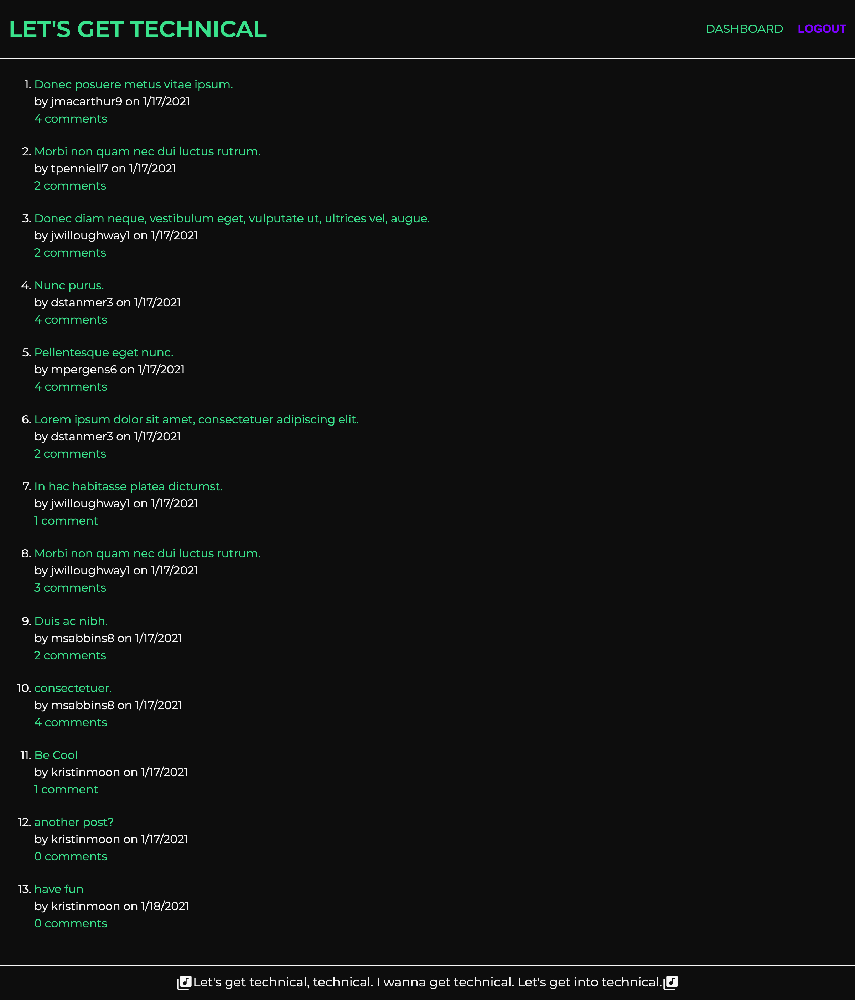
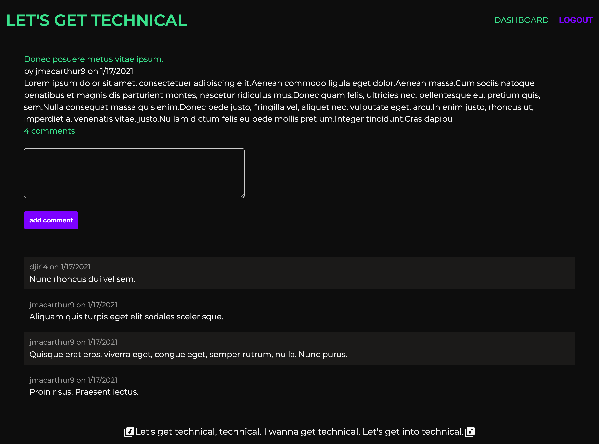

  # Let's Get Technical

  ## Description
  Writing about tech can be just as important as making it. [Let's Get Technical](https://powerful-temple-08997.herokuapp.com/) is a CMS-style blog site where developers can publish blog posts and comment on other developers’ posts as well. 

  ## Table Of Contents
  * [Installation](#installation)
  * [Usage](#usage)
  * [Contribution](#contribution)
  * [Questions](#questions)

  ## Installation
  Please download the files located in this [repository](https://github.com/kristinmoon/lets-get-technical) to create a new blog, however, I invite you to join in on the conversation by posting and commenting at [Let's Get Technical](https://powerful-temple-08997.herokuapp.com/), rather than creating an entirely new blog. 
  
  You will need to use express-handlebars package to use Handlebars.js for your Views, use the MySQL2 and Sequelize packages to connect to a MySQL database for your Models, and create an Express.js API for your Controllers. You’ll also need the dotenv package to use environment variables, the bcrypt package to hash passwords, and the express-session, and connect-session-sequelize packages to add authentication.

  ## Usage
  Get a feel for the application in the below screenshots...
  
  

  ## Contribution
  I always welcome any suggestions you may have to improve my projects' functionality. Please see below for how to contact me.

  ## Questions
  Please contact me at [kristin@icloud.com](mailto:kristin@icloud.com) with any questions. You can also find me on GitHub, username [kristinmoon](https://github.com/kristinmoon).
